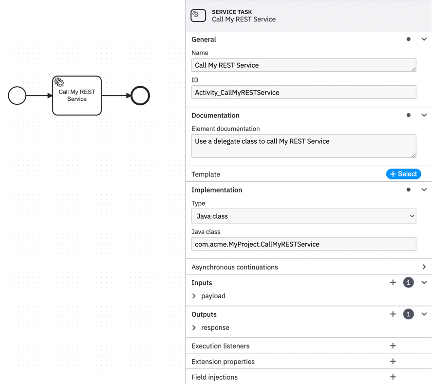
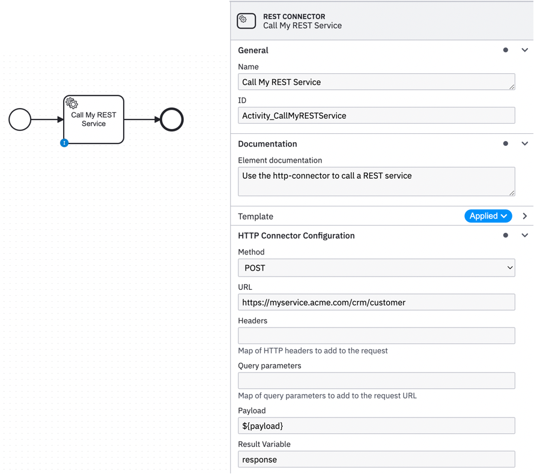

# Camunda 7 REST Worker

Even though we more normally associate C8 with Connectors, Camunda 7 does support them - see
[Connectors](https://docs.camunda.org/manual/7.21/user-guide/process-engine/connectors/)
and [Camunda Connector Reference](https://docs.camunda.org/manual/7.21/reference/connect/). 
C7 even comes with HTTP and SOAP Connectors OOTB.
However, the implementation of these OOTB Connectors in C7 suffer from a serious limitation -
they run in the engine (as delegates) and thus can have a significant impact on engine performance. 
Indeed this is such a limitation that the 'standard' advice seems to be to 
[avoid them altogether](https://forum.camunda.io/t/platform-7-connectors-rest-api/44282)

Nevertheless the appeal of a centralised, scalable REST implementation - 
along with a Connector template in the Modeler - for C7
is strong enough that we wanted to see if we could find a solution for this, 
not least to support clients working on migrating to C8.

## Camunda 7 REST Connector as a facilitator for Camunda 8 migration
If your C7 processes are accessing external services via REST calls then you can simplify your
migration to C8 by incrementally moving your existing C7 REST calls to the REST Connector described
here which implements the same Remote Server pattern used in C8 -
even with your existing embedded C7 solution. 

For example, in this diagram what we see the original is a custom REST implementation built into the Java class
`com.acme.MyProject.CallMyRESTService` 



But this can be replaced with a call to the BP3 REST Connector as shown below.
Here we are making use of the provided Connector Template to the underlying BP3 REST Connector



Whilst this may appear a small change to your process the implications can be significant. 
Here are some of the pros & cons

**Pros**
- Engine performance can be significantly improved
- As you translate existing delegate service tasks to external tasks your process becomes increasingly "C8-ready"

**Cons**
- You will have to find somewhere to run the REST job worker
(N.B. If you run it on the same server as your embedded solution then you likely won't realise the potential
performance benefits!)

## REST Job Worker
At BP3 we try whenever we can to address problems at their root cause rather than dealing with the
symptoms. Our experience with C8 is that we firmly believe in Connectors and so we wanted to see
if we couldn't find a way to leverage these Connectors in C7 in the right way. As it turns out
that really isn't that difficult to do. Fortunately, Camunda makes available a jarfile that 
contains the implementation of the REST call, so all that is really required is to wrap this
into a job worker which can process the corresponding external tasks in the process. We provide 
this worker implementation here and a Dockerfile that will package this worker for you.

### Spring Boot App
This repo contains a Spring Boot app to implement the Job Worker. 
Details of how to deploy and configure this Job Worker can be found below.

### Dockerfile
The Dockerfile is based upon the Dockerfiles used by Camunda to build their RUN images - see 
(Camunda Run)[https://github.com/camunda/docker-camunda-bpm-platform].
So, it is based upon the same image to minimise the layers you need to pull into your local image
repository.

## Modeler Element Template
To bring all of this together we also provide an "element template" for the Modeler which simplifies
the external task definition.

Repo Contents

- Build file - references Camunda built jarfile
- Spring Boot app containing Job Worker - produces jarfile
- Dockerfile
- Element template

# Building the project 
## Building the jarfile locally

```bash
docker run -it --rm --name gradle \
    --mount type=bind,src=$(PWD),dst=/builds -w /builds \
        gradle:jdk17 gradle --build-cache build
```
The build can be modified using the following environment variables

| Environment Variable        | Description                                    | Default        |
|-----------------------------|------------------------------------------------|----------------|
| CONNECTOR_VERSION           | The version to give to the built artifact(s)   | 0.0.1-SNAPSHOT |
| CAMUNDA_VERSION             | The version of Camunda 7 that we are building against | 7.21.0  |
| CAMUNDA_HTTP_CLIENT_VERSION | The version of the Camunda HTTP Cliet to use            | 1.6.0 |

## Building the docker image locally

```bash
docker build -t c7-rest-worker:7.21.0 .
```

# Running the worker
## Configuration
As far as possible the container can be configured via environment variables. The following environment
are supported

| EnvVar               | Description                                                        | Default                           |
|----------------------|--------------------------------------------------------------------|-----------------------------------|
| ENGINE_ENDPOINT      | URL of the Camunda 7 Engine REST API                               | http://localhost:8080/engine-rest |
| CLIENT_ASYNC_TIMEOUT | Maximum duration of the long-polling request                       | 1000                              |
| CLIENT_LOCK_DURATION | How long the service tasks are locked until they can fetched again | 10000                             |
| LOG_LEVEL            | Amount of log messages that will be output                         | DEBUG                             |

## Running the worker as a jarfile
```bash
$ ENGINE_ENDPOINT=http://c7host.mynet/engine-rest java -Dxxx=yyy -jar C7RESTConnector-<version>.jar
```

## Running the worker from the Docker image 

The simplest way to run the docker image is as follows

```bash
$ docker run -it --rm \
    --name c7-worker \
    -e ENGINE_ENDPOINT=http://c7host.mynet/engine-rest \
          bp3/camunda7/c7-rest-worker:7.21.0 [options]
          
where 'options' are a list of flags for the 'java' command, e.g. -Dxxx=yyy
```

which you can obviously adapt to your own circumstances.
